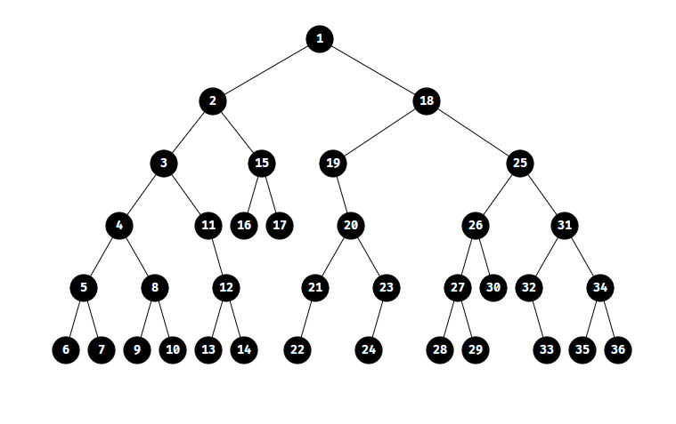
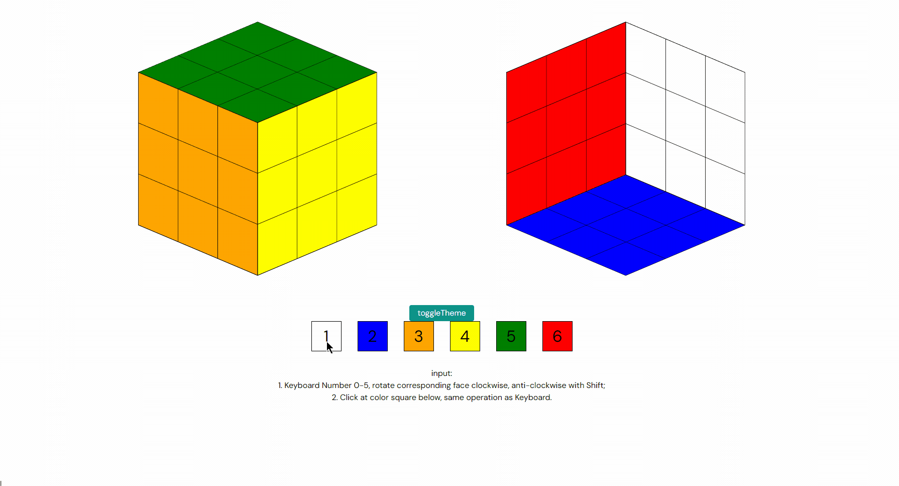

# Components

Here are some Vue3 SFC components.

use [vitesse-lite](https://github.com/antfu/vitesse-lite)

> SHOULD NOT use in production directly.

| folder      | describe                  |
| ----------- | ------------------------- |
| random-tree | visualize tree, using SVG |
| rubiks-cube | Rubik's Cube Simulation   |
|             |                           |

## demonstration

#### random-tree

#### rubiks-cube

